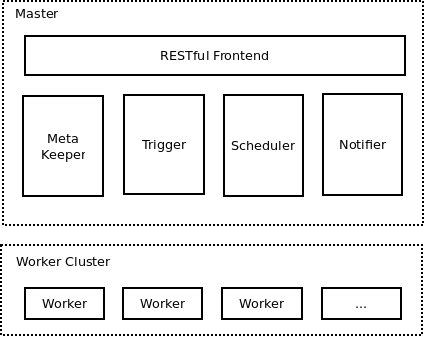
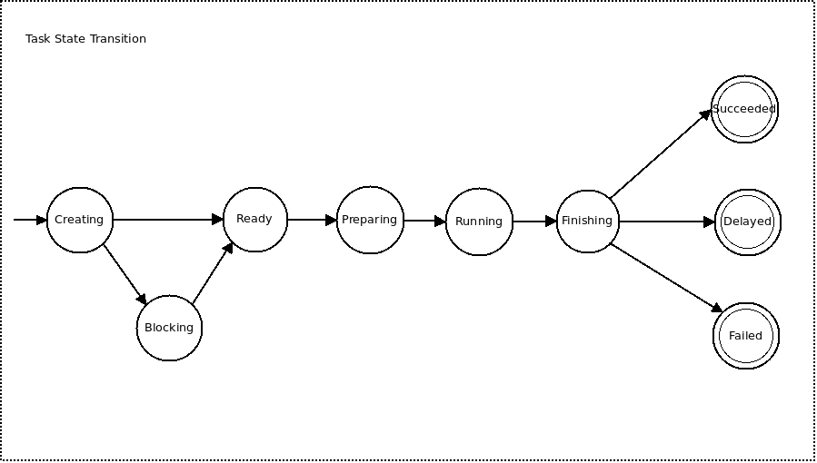
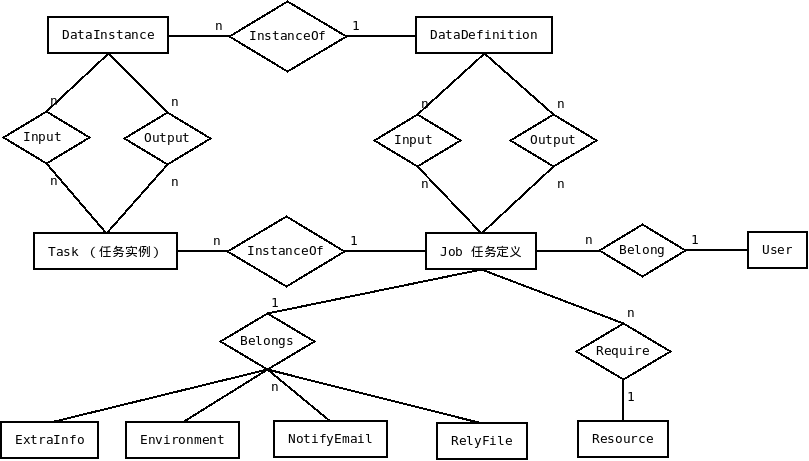

Architecture
============
本章给出Arbiter的总体架构。

Arbiter使用了akka的actor框架来组织自己的整体结构，充分利用异步消息处理。采用actor分布式框架的原因包括：

1.  成熟稳定。Actor模型本身被其在电信领域的长期应用所验证。而Akka的actor框架实现则被在spark等项目中的使用所验证。
2.  易用。Actor抽象比更基础的rpc抽象更加易用。Akka的actor系统本身还提供了其它公共组件，如akka-remote，
    akka-cluster、akka-testkit等，方便分布式系统的开发。

总体架构
--------
Arbiter的主要模块如下图所示。

其中：

1.  *RESTful Frontend*：是前端，客户端（用户）所有的交互都由它负责。它主要用户实现RESTful API。

1.  *Meta Keeper*：保存调度相关的所有的元数据，如Job、Task相关的信息。0.1版的Meta实际上存储在一个MySQL服务器中。

1.  *Trigger*：Task触发器。它的主要任务是定期从Job触发出Task。例如，对于天级的Job，如果没有指定触发时间，那么每天
    零晨00：00会触发出一个Task实例，刚刚触发出来的Task处于准备状态。

1.  *Scheduler*：Task调度器。它的主要任务是，维护所有task的状态（以及状态转换），使用某个调度策略将任务提交执行。
    该组件是arbiter的控制核心。

1.  *Notifier*：通知器。它的主要任务是当任务结束后，根据预定的策略发送通知邮件。

1.  *Worker Cluster*：这部分包含若干台机器，每台机器上又可能有若干个worker，负责具体执行某个task。

Arbiter的主要交互如下图所示。(TODO)

Arbiter中的任务状态转换如下图所示。

其中：

1.  任务被Trigger触发后进入Creating状态。

1.  Scheduler会将任务更改为Blocking（如果存在未满足的数据依赖）或者Ready（所有数据依赖均满足）状态。

1.  处于Ready状态的任务会根据调度策略和资源情况调度执行，执行本身包含三个阶段：
    1.  Preparing，准备执行环境。
    1.  Running，执行。
    1.  Finishing，清理执行环境。

1.  清理完执行环境后，Task会进入三个永久状态之一：
    1.  Succeeded，成功。
    1.  Delayed，执行成功，但未满足期望的完成时间。
    1.  Failed，执行失败。(对于失败状态，需要触发一个新的Task）。

对于处于Blocking, Ready, Preparing, Running, Finishing几个状态的任务，还有另外一个属性：delayingRisk，
这是一个`[0, 1]`区间的值，表示该任务延时的概率。`1`表示已经延时。当发生延时时，发送报警邮件。

Arbiter的元数据持久化在RDBMS中。RDBMS中的结构如下ER图所示。

